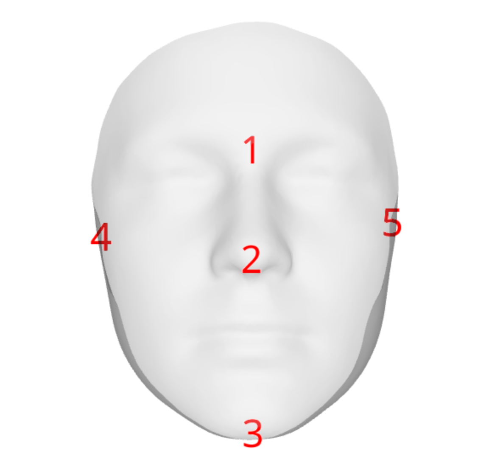

# Morpholand

This repo is meant to ease the pain of installing morphometrics tools to perform non-linear registration of meshes. We approach this problem by building a Docker image that should install on any operating system.

# How the pipeline works

1. Manually landmark each individual mesh with guide points. This can be done using [Meshlab's](https://www.meshlab.net/) pick point tool. The 5 points used for this template are shown in order below.



2. Work through the provided script register_mesh_statismo.R. This will load the target mesh and template, do initial alignments and non-linear deformation of the template to the target mesh.

# How to build the docker image and get Rstudio running

You will need to install Docker to get any of this running. Instructions [here](https://docs.docker.com/get-docker/).

Simple Docker builds are a two-step process. First it builds an image which installs all the software listed in the Dockerfile. Second is a run command that tells Docker to run a containerized instance of the image. 

Here's an example workflow. First, open a terminal and ```cd``` to the directory with this Dockerfile in it. Then:

```docker build . -t morpholand```

The ```-t``` flag give our image a tag. Without it Docker will make up a name, but it's easier to refer to something you've named. This build step will take a while creating an Ubuntu install and compiling all of the packages, so leave this running in the background or something. 

Once you've successfully built the image, you can now run it with:

```docker run -d -p 8787:8787 -e ROOT=TRUE -e PASSWORD=yourpasswordhere morpholand```

The ```-d``` flag runs the container in detached mode, which means that the terminal does not have to stay busy to continue running the container/Rstudio. You can stop the container by going to the docker GUI dashboard and hitting the stop button. The ```-p``` flag tells Docker to map the container's 8787 port to your computer's 8787 port. Rstudio runs on 8787 by default in the image, but you can change the second 8787 if you'd like the container on a different port on your machine. 

To open up Rstudio navigate to localhost:8787. The default user will be rstudio, with the password that you specify. ```ROOT=TRUE``` gives you the ability to install tools from the Ubuntu terminal with ```sudo```, but they should probably just be added as build steps in the Dockerfile. 

More ```docker run``` configuration options for Rstudio can be found on the [Rstudio docker page](https://hub.docker.com/r/rocker/rstudio).

